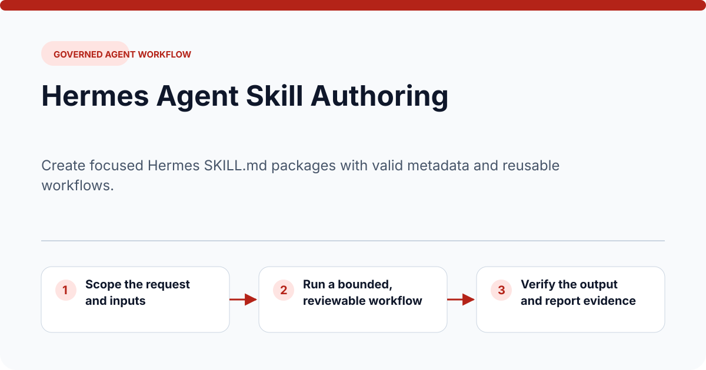
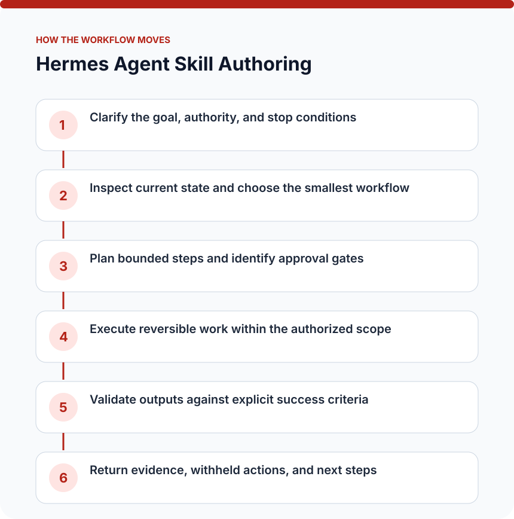
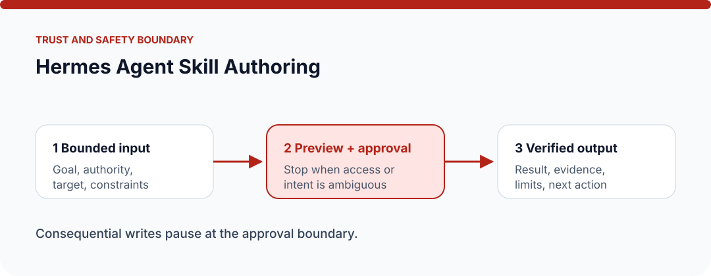

  

# Hermes Agent Skill Authoring

> Create focused Hermes SKILL.md packages with valid metadata and reusable workflows.

This repository packages a single, reusable Hermes skill as a documentation-first public reference. It explains the problem, operating contract, safety boundaries, expected evidence, and example usage without claiming a bundled runtime that is not present.

## Why this exists

Agent work becomes unreliable when scope, handoffs, approval boundaries, and proof of completion remain implicit. **Hermes Agent Skill Authoring** turns that work into an explicit sequence with visible inputs, outputs, review points, and completion evidence.

## Why the repository has this name

The shared `hermes-skill-` prefix identifies this as a portable Hermes workflow package. `hermes-agent-skill-authoring` names the capability directly—hermes agent skill authoring—so the repository remains searchable and understandable outside the original AI-OS workspace. The public title is **Hermes Agent Skill Authoring**.

## At a glance

| Question | Answer |
| --- | --- |
| What is it? | Governed agent workflow packaged as a reusable Hermes `SKILL.md`. |
| What does it do? | Create focused Hermes SKILL.md packages with valid metadata and reusable workflows. |
| Who is it for? | Builders, operators, and reviewers who want a repeatable, inspectable workflow. |
| What is delivered? | A skill contract, examples, safety guidance, release checks, and rendered SVG diagrams. |
| Runtime status | Documentation-first reference package; connect it to the tools available in your own environment. |

## How it works

  

1. Clarify the goal, authority, and stop conditions
2. Inspect current state and choose the smallest workflow
3. Plan bounded steps and identify approval gates
4. Execute reversible work within the authorized scope
5. Validate outputs against explicit success criteria
6. Return evidence, withheld actions, and next steps

See [How it works](docs/HOW-IT-WORKS.md) for the detailed walkthrough, decision points, and verification checklist.

## Inputs

- A user goal with explicit authority and boundaries
- Available tools, artifacts, and current state
- Approval requirements and success criteria

## Outputs

- A durable workflow or agent-ready artifact
- Visible approval and safety boundaries
- Deterministic evidence of completion or a clear stop reason

## Example request

> For a bounded, reversible task, create focused Hermes SKILL.md packages with valid metadata and reusable workflows. Return the result, the evidence used to verify it, and any limitations or actions that still require approval.

More scenarios and expected results are in [Examples](docs/EXAMPLES.md).

## Safety and trust model

  

This workflow may create or change artifacts, so consequential actions require a preview and explicit authorization. It must stop when ownership, authorization, target state, or publication safety is ambiguous. Never place credentials, private endpoints, personal data, or environment-specific secrets in the skill package or its evidence.

Read [SAFETY.md](SAFETY.md) and [SECURITY.md](SECURITY.md) before connecting the workflow to real accounts, devices, repositories, or production data.

## What this repository does not claim

- It does not expand user authority, conceal side effects, or treat unverified output as complete.
- It is not a hosted service, executable application, or vendor endorsement.
- It does not include credentials, private infrastructure, or the original personal AI-OS configuration.
- A successful example does not prove production readiness for every environment.

## Repository map

| Path | Purpose |
| --- | --- |
| `SKILL.md` | Concise trigger conditions and operating workflow used by an agent. |
| `docs/PRODUCT.md` | Problem framing, audience, boundaries, and readiness model. |
| `docs/HOW-IT-WORKS.md` | Expanded walkthrough with diagrams and verification points. |
| `docs/EXAMPLES.md` | Realistic safe, review-only, and stop-condition scenarios. |
| `docs/RELEASE.md` | Checks to complete before publishing a revision. |
| `assets/*.svg` | Accessible, GitHub-rendered visual explanations. |
| `tests/README.md` | Manual contract and package validation guidance. |
| `SAFETY.md` / `SECURITY.md` | Operational and disclosure boundaries. |

## Use this package

1. Read `SKILL.md` and confirm its trigger matches your task.
2. Copy the package into the skill location supported by your agent environment, or use it as a reference when authoring an equivalent workflow.
3. Replace tool assumptions with the tools actually available to you; do not add secrets to the repository.
4. Run the smallest safe example from `docs/EXAMPLES.md`.
5. Record verification evidence and review any consequential action before widening scope.

## Contributing

Improvements are welcome when they preserve narrow scope, honest capability claims, safe defaults, and reproducible verification. See [CONTRIBUTING.md](CONTRIBUTING.md).
