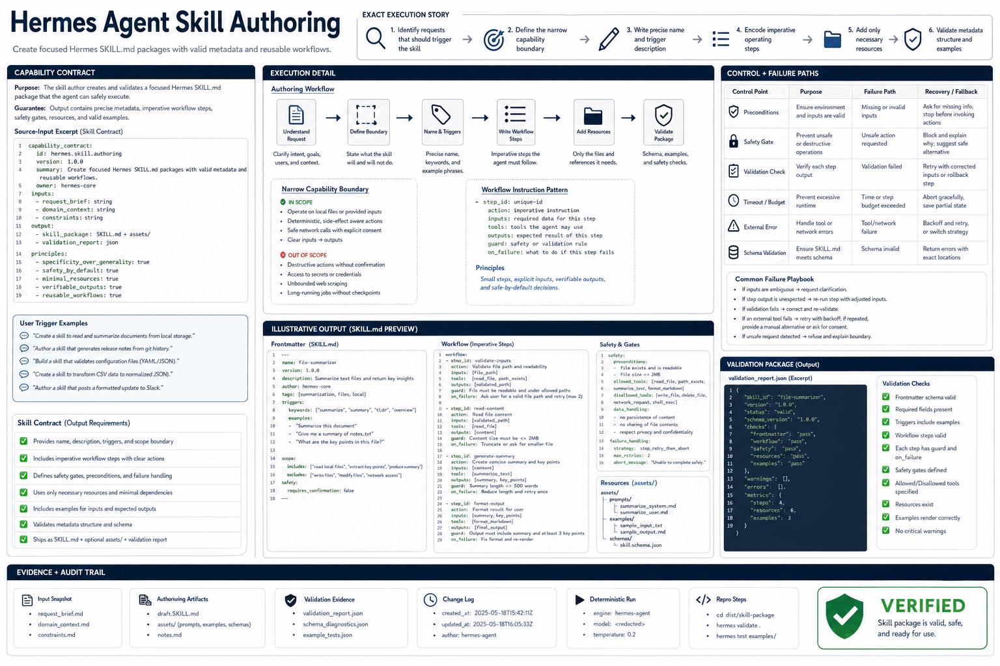

# How Hermes Agent Skill Authoring Works

Create focused Hermes SKILL.md packages with valid metadata and reusable workflows.

## Stages

### 1. Identify requests that should trigger the skill

**Primary surface:** `User trigger examples`

Record the input, operation, observable output, and any decision that changes scope. Stop here if the output is missing, contradictory, or insufficient for the next stage.
### 2. Define the narrow capability boundary

**Primary surface:** `Skill contract`

Record the input, operation, observable output, and any decision that changes scope. Stop here if the output is missing, contradictory, or insufficient for the next stage.
### 3. Write precise name and trigger description

**Primary surface:** `SKILL.md frontmatter`

Record the input, operation, observable output, and any decision that changes scope. Stop here if the output is missing, contradictory, or insufficient for the next stage.
### 4. Encode imperative operating steps

**Primary surface:** `Workflow instructions`

Record the input, operation, observable output, and any decision that changes scope. Stop here if the output is missing, contradictory, or insufficient for the next stage.
### 5. Add only necessary resources

**Primary surface:** `Validation package`

Record the input, operation, observable output, and any decision that changes scope. Stop here if the output is missing, contradictory, or insufficient for the next stage.
### 6. Validate metadata structure and examples

**Primary surface:** `Validation package`

Record the input, operation, observable output, and any decision that changes scope. Stop here if the output is missing, contradictory, or insufficient for the next stage.

## Failure handling

- **Authorization failure:** do not probe credentials or broaden access; report the missing authority.
- **Target ambiguity:** stop before mutation and request the minimum identifying information.
- **Tool or service failure:** retain error evidence, retry only safe transient failures, and cap retries.
- **Verification failure:** classify the run as incomplete even when the preceding operation returned success.

## Completion evidence

The handoff should contain the original request, inspection state, preview or plan, exact execution result, direct verification, and a final receipt naming limitations and withheld actions.
