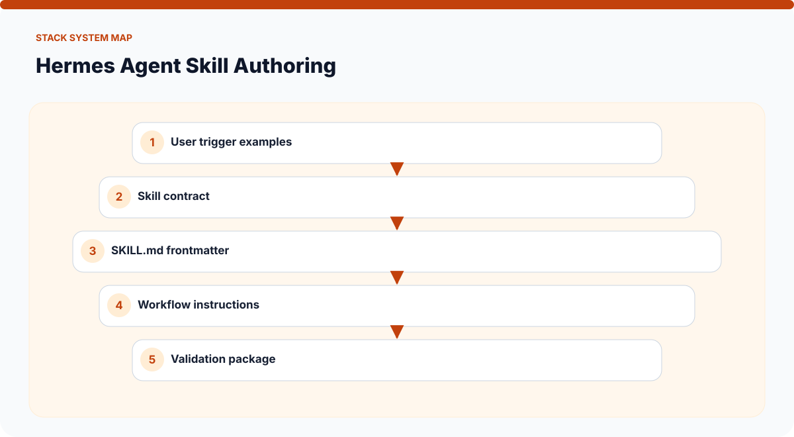
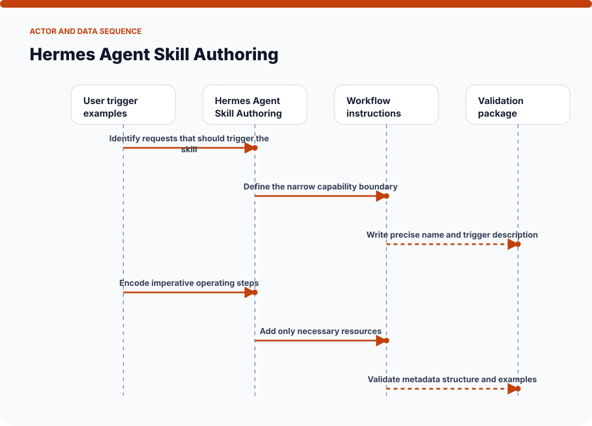
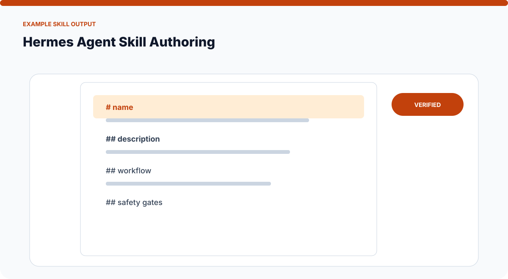
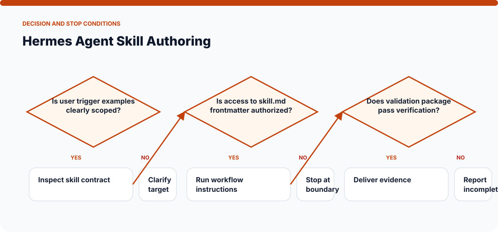

# How Hermes Agent Skill Authoring Works

The visuals on this page are static SVGs, so they render directly on GitHub on phones and desktop browsers. Each one is generated from a model specific to this skill.

## System architecture

### Components

- **1. User trigger examples:** participates in identify requests that should trigger the skill.
- **2. Skill contract:** participates in define the narrow capability boundary.
- **3. SKILL.md frontmatter:** participates in write precise name and trigger description.
- **4. Workflow instructions:** participates in encode imperative operating steps.
- **5. Validation package:** participates in add only necessary resources.

## Actor and data sequence

### 1. Identify requests that should trigger the skill

**Primary surface:** `User trigger examples`

Record the concrete input, the operation performed, and the evidence produced at this stage. Continue only when the output is sufficient for the next stage; otherwise preserve the blocker and stop.
### 2. Define the narrow capability boundary

**Primary surface:** `Skill contract`

Record the concrete input, the operation performed, and the evidence produced at this stage. Continue only when the output is sufficient for the next stage; otherwise preserve the blocker and stop.
### 3. Write precise name and trigger description

**Primary surface:** `SKILL.md frontmatter`

Record the concrete input, the operation performed, and the evidence produced at this stage. Continue only when the output is sufficient for the next stage; otherwise preserve the blocker and stop.
### 4. Encode imperative operating steps

**Primary surface:** `Workflow instructions`

Record the concrete input, the operation performed, and the evidence produced at this stage. Continue only when the output is sufficient for the next stage; otherwise preserve the blocker and stop.
### 5. Add only necessary resources

**Primary surface:** `Validation package`

Record the concrete input, the operation performed, and the evidence produced at this stage. Continue only when the output is sufficient for the next stage; otherwise preserve the blocker and stop.
### 6. Validate metadata structure and examples

**Primary surface:** `User trigger examples`

Record the concrete input, the operation performed, and the evidence produced at this stage. Continue only when the output is sufficient for the next stage; otherwise preserve the blocker and stop.

## Example output shape

The example is a visual contract: a real run may look different, but it should expose comparable state, provenance, and verification information. It is not presented as evidence of a live external action.

## Decision and stop conditions

The workflow stops when the target is ambiguous, the relevant surface is unavailable or unauthorized, or the final artifact cannot be checked. A logged-in session or successful tool call is not by itself proof that the requested outcome is complete.

## Verification checklist

- Confirm every component shown in the system map exists in the target environment.
- Trace the actor sequence using actual tool output or artifact state.
- Compare the result with the example-output information contract.
- Re-read or reopen the final artifact instead of trusting an attempt message.
- Report omitted stages, unsupported capabilities, and remaining human decisions.
